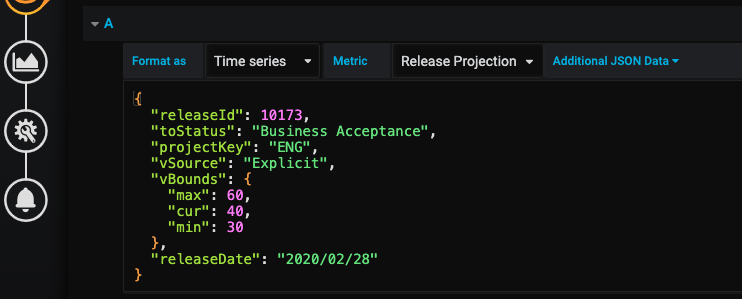

# jira-grafana-team-metrics-datasource
Grafana Datasource that connects to JIRA and analyses data to produce team management metrics such as velocity and cycle time

## Development / Usage
* Create a .env file like the .env-example file but with your JIRA credentials (the password is the key you generate from your atlassian account, not your actual password)
* If using VS Code, run a debug session using the "Launch via npm" configuration
* From the command link run it with npm using `npm start`

## Dashboard query configuration
Many of the queries the service supports have required and optional parameters supplied using custom JSON input data such as in the image below.



The configuration options for each metric are specified here.

### Current 2 week velocity

Example: `{"toStatus": "Deployed", "projectKey": "ENG", "addBugsDefault": false}`

| Key | Description | Possible Values | Descriptions |
| --- | ----------- | --------------- | ------------ |
| toStatus | The status the velocity calculation considers to be "complete" | Any status in the value stream | The name of the status |
| projectKey | The project for which velocity is being calculated. Only issues that are part of the specified project at the time of completion count towards the velocity | Any JIRA project key | The JIRA project key |
| addBugsDefault | if true then if bugs don't have a size then their size is returned with a default bug size | true, false | |
| bugDefaultSize | The default size to use for bugs if addBugsDefault is true (if unspecified then a hard coded default of 2 story points is used) | any integer | |

### Rolling 2 week velocity

Example: `{"toStatus": "Deployed", "projectKey": "ENG", "addBugsDefault": true, "bugDefaultSize": 2}`

| Key | Description | Possible Values | Descriptions |
| --- | ----------- | --------------- | ------------ |
| toStatus | The status the velocity calculation considers to be "complete" | Any status in the value stream | The name of the status |
| projectKey | The project for which velocity is being calculated. Only issues that are part of the specified project at the time of completion count towards the velocity | Any JIRA project key | The JIRA project key |
| addBugsDefault | if true then if bugs don't have a size then their size is returned with a default bug size | true, false | |
| bugDefaultSize | The default size to use for bugs if addBugsDefault is true (if unspecified then a hard coded default of 2 story points is used) | any integer | |

### Current 2 week average cycle time per point

Example: `{"toStatus": "Deployed", "fromStatus": "Prioritised", "projectKey": "ENG"}`

| Key | Description | Possible Values | Descriptions |
| --- | ----------- | --------------- | ------------ |
| toStatus | When a ticket enters this status, the cycle-time clock stops | Any status in the value stream | The name of the status |
| fromStatus | When a ticket leaves this status, the cycle-time clock starts | Any status in the value stream | The name of the status |
| projectKey | The project for which velocity is being calculated. Only issues that are part of the specified project at the time of completion count towards the velocity | Any JIRA project key | The JIRA project key |

### Rolling 2 week average cycle time per point

Example: `{"toStatus": "Deployed", "fromStatus": "Prioritised", "projectKey": "ENG"}`

| Key | Description | Possible Values | Descriptions |
| --- | ----------- | --------------- | ------------ |
| toStatus | When a ticket enters this status, the cycle-time clock stops | Any status in the value stream | The name of the status |
| fromStatus | When a ticket leaves this status, the cycle-time clock starts | Any status in the value stream | The name of the status |
| projectKey | The project for which velocity is being calculated. Only issues that are part of the specified project at the time of completion count towards the velocity | Any JIRA project key | The JIRA project key |

### Release Progress

Example: `{"versionIds": [10173, 10166]}`

| Key | Description | Possible Values | Descriptions |
| --- | ----------- | --------------- | ------------ |
| versionIds | An array of the JIRA release IDs for the versions to display | Release ID numbers | The numbers |

### Release Projection

Example: 

```
{
  "releaseId": 10173, 
  "toStatus": "Business Acceptance",
  "projectKey": "ENG",
  "vSource": "Explicit",
  "vBounds": {
    "max": 60,
    "cur": 40,
    "min": 30
  },
  "releaseDate": "2020/02/28",
  "addBugsDefault": true,
  "bugDefaultSize": 2
}
```

| Key | Description | Possible Values | Descriptions |
| --- | ----------- | --------------- | ------------ |
| releaseId | The release to calculate the project for | JIRA Release ID number | The number |
| toStatus | The status the velocity calculation considers to be "complete" | Any status in the value stream | The name of the status |
| projectKey | The project for which velocity is being calculated. Only issues that are part of the specified project at the time of completion count towards the velocity | Any JIRA project key | The JIRA project key |
| vSource | The source used for the velocity values | `Explicit` | The velocity bounds to display are specified in config under `vBounds` |
|         |                                         | `Limits` | The velocity bounds are calculated from the `projectKey` velocity in the timeframe displayed with the minimum, current and maximum velocities in the timeframe used to calculate the bounds of the projection |
| vBounds | Only required if `vSource` == `Explicit`. Specifies the min, max and current velocities to use for projection. Required 2 weekly velocity figures in story points | `{"max": X, "cur": Y, "min": Z}` | Must be in the specified nested JSON structure. X, Y and Z being velocity values which can be fractional |
| releaseDate | A planned release date. Used to show a vertical line on the burnup | Any valid date format, e.g. YYYY/MM/DD | The release date |
| addBugsDefault | if true then if bugs don't have a size then their size is returned with a default bug size | true, false | |
| bugDefaultSize | The default size to use for bugs if addBugsDefault is true (if unspecified then a hard coded default of 2 story points is used) | any integer | |

## Running on a Raspberry PI

Make sure the Simple JSON plugin is installed on your grafana instance:

`sudo grafana-cli plugins install simpod-json-datasource`

Set up the datasource:

1. Add new datasource in the Grafana UI
2. Name: JSON
3. URL: http://localhost:3030
4. Everything else turned off

Set up the dashboard:

1. Go to manage dashboards on the Grafana UI
2. Click "Upload JSON"
3. Navigate to the json file in the grafana sub-directory of this project on your lcoal machine and import it

To run this as a service on a raspberry pi:

1. `sudo cp jira-metrics.service /etc/systemd/system/`
2. `sudo chmod u+rwx /etc/systemd/system/jira-metrics.service`
3. `sudo systemctl enable jira-metrics`

To control the service manually:

*Start*: sudo systemctl start jira-metrics
*Stop*: sudo systemctl stop jira-metrics

To see the output log:

`cat /var/log/syslog`